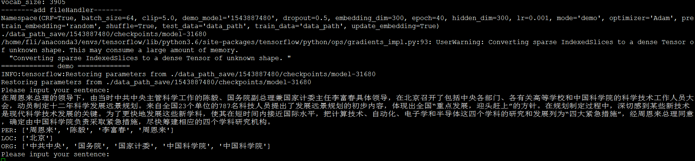

### 前言
该模型是一个基于字符的BiLSTM-CRF序列标注模型。

运行代码环境：tensorflow>=tf1.10

### 模型介绍

整个模型共分三层:

第一层：向量查找层。目的是将输入的字符汉字转化为对应的字符向量（采用的是one-hot方法）

第二层：双向LSTM。目的是有效地自动提取输入信息的特征。

第三层：CRF层。顶层使用CRF对句子中的字符打标签，完成标注。

### 训练方法
输入如下命令，开始训练模型

`python main.py --mode train --dataset_name MSRA`

语料库选择，修改`--dataset_name`参数（MSRA, ResumeNER, WeiboNER,人民日报）

使用预训练的字向量，设置参数`--use_pre_emb true`，默认为false

训练的策略：

当f1score_valid小于最大的f1score_valid,并且f1score_train大于最大的f1socre_train-0.1，说明过拟合

则学习率减半，并且载入最大的f1socre_valid模型重新训练。

### 数据集介绍
~~训练其他语料库的话，由于不同语料库的**实体类别**可能存在差异，需要修改`data.py`代码中的tag2label~~，

| MSRA实体类别 | 标签(BIO标记法) |
| ------ | ------ |
| 人名  | B-PER I-PER |
| 地名  | B-LOC I-LOC |
| 机构名 | B-ORG I-ORG|

| 人民日报实体类别 | 标签(BIO标记法) |
| ------ | ------ |
| 人名       | B-PERSON I-PERSON |
| 普通地名    | B-LOC I-LOC |
| 行政区划地名 | B-GPE I-GPE |
| 机构名 | B-ORG I-ORG|
| 其他   | B-MISC I-MISC|

| WeiboNER实体类别 | 标签(BIO标记法) |
| ------ | ------ |
| 人名  | B-PER.NAM I-PER.NAM |
| 地名  | B-LOC.NAM I-LOC.NAM |
| 机构名 | B-ORG.NAM I-ORG.NAM|
| GPE-political | B-GPE.NAM I-GPE.NAM|
| 人名(nominal)  | B-PER.NOM I-PER.NOM |
| 地名(nominal)  | B-LOC.NOM I-LOC.NOM |
| 机构名(nominal) | B-ORG.NOM I-ORG.NOM|

| ResumeNER实体类别 | 标签(IOBES标记法) |
| ------ | ------ |
| 人名  | B-NAME M-NAME  E-NAME、S-NAME |
| 民族/种族  | B-RACE M-RACE  E-RACE、S-RACE |
| 国家  | B-CONT M-CONT E-CONT、S-CONT  |
| 地名 | B-LOC M-LOC E-LOC、S-LOC|
| 专业 | B-PRO M-PRO E-PRO、S-PRO|
| 学历 | B-EDU M-EDU E-EDU、S-EDU|
| 职位 | B-TITLE M-TITLE E-TITLE、S-TITLE|
| 组织机构 |  B-ORG M-ORG E-ORG 、S-ORG|

### 测试方法
输入如下命令完成测试集测试

`python main.py --mode test --dataset_name MSRA --demo_model 1522858865`

备注:训练过程中，每开始一次都会在“data_path_save/”目录下产生一个文件夹(以时间转换为整数来命名的)，将训练的参数保存。
     当测试的时候，想用哪次训练的参数进行测试，就将该次训练的文件名赋值给“--demo_model"，即替换上面命令中的"1522858865"。
     ”1522858865“是我在训练时的最后参数。

### 演示
在这里可以输入一段文本，查看识别结果。

运行命令如下;

`python main.py --mode demo --dataset_name MSRA --demo_model 1522858865`

运行程序后，会提示输入一段文本，输入后就可以看到通过该代码识别的结果。

### 需要注意的事
1、假如negative_label=['O'],当标签为[O,O,B-per,I-per,O,O,O,B-ori,I-ori,I-ori,O,O]
预测标签为：[O,O,B-per,I-per,I-per,I-per,O,B-ori,I-ori,O,O,O]时，recal=4/5而precision=4/6,所以f1score=2(recal*precisio)/(recall+precision)=0.727
2、
iobes标记法：
    B，即Begin，表示开始
    I，即Intermediate，表示中间
    E，即End，表示结尾
    S，即Single，表示单个字符
    O，即Other，表示其他，用于标记无关字符
iobes标记法会有利于提升模型的法f1score
当iob2iobes为True时，则会自动把原本为iob格式变成iobes格式的，如：['O','O','B-per','I-per','O','O','O','B-ori','I-ori','I-ori','O','O','B-per']就会变成['O','O','B-per','E-per','O','O','O','B-ori','I-ori','E-ori','O','O','S-per']
当测试和验证的时候，又会自动把iobes转变成iob,所以计算f1score还是计算iob的
### 参考
\[1\] [Determined22/zh-NER-TF](https://github.com/Determined22/zh-NER-TF)
